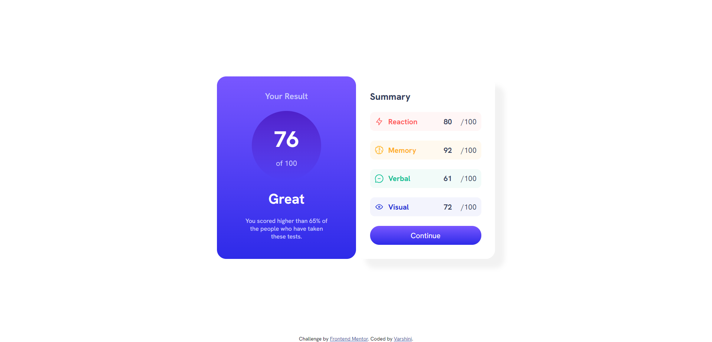

# Frontend Mentor - Results summary component solution

This is a solution to the [Results summary component challenge on Frontend Mentor](https://www.frontendmentor.io/challenges/results-summary-component-CE_K6s0maV). Frontend Mentor challenges help you improve your coding skills by building realistic projects. 

## Table of contents

- [Overview](#overview)
  - [The challenge](#the-challenge)
  - [Screenshot](#screenshot)
  - [Links](#links)
- [My process](#my-process)
  - [Built with](#built-with)
  - [What I learned](#what-i-learned)
  - [Continued development](#continued-development)
 
## Overview

The Results Summary Component is a simple yet effective UI element designed to display a summary of results. This component was built as a part of the Frontend Mentor challenges to practice HTML and CSS skills.

### The challenge

Users should be able to:

- View the optimal layout for the interface depending on their device's screen size
- See hover and focus states for all interactive elements on the page

### Screenshot




### Links

- Solution URL: [Git Repo](https://github.com/varshini-0506/frontend-mentor-results-summary.git)
- Live Site URL: [Website link]( https://varshini-0506.github.io/frontend-mentor-results-summary/)

## My process

- Planning and Setup: Reviewed the design specifications and assets provided by Frontend Mentor.
Set up the project structure with necessary HTML and CSS files.

- HTML Structure: Created the basic HTML structure to define the component layout, including sections for the result summary and individual result items.

- Styling with CSS: Applied CSS to style the component, focusing on typography, colors, and layout.
Ensured responsiveness using media queries to adjust the layout for different screen sizes.


### Built with

- Semantic HTML5 markup
- CSS custom properties
- Flexbox

### What I learned

```html
<div class="icon" id="one">
  
  <h4>Reaction</h4>
  <b>80</b>
  <p>/100</p>
</div>
```
```css
.next:hover {
    cursor: pointer;
    background-image: linear-gradient(hsl(252, 100%, 67%), hsl(241, 81%, 54%));
}
```
### Continued development

- Accessibility Enhancements: Improve accessibility features such as adding ARIA labels and ensuring keyboard navigation support.
- Interactivity: Add interactive elements using JavaScript, such as animations or dynamic data updates.
- Theming: Implement theming options to allow users to switch between different styles.
- Performance Optimization: Optimize the component for faster load times and better performance.